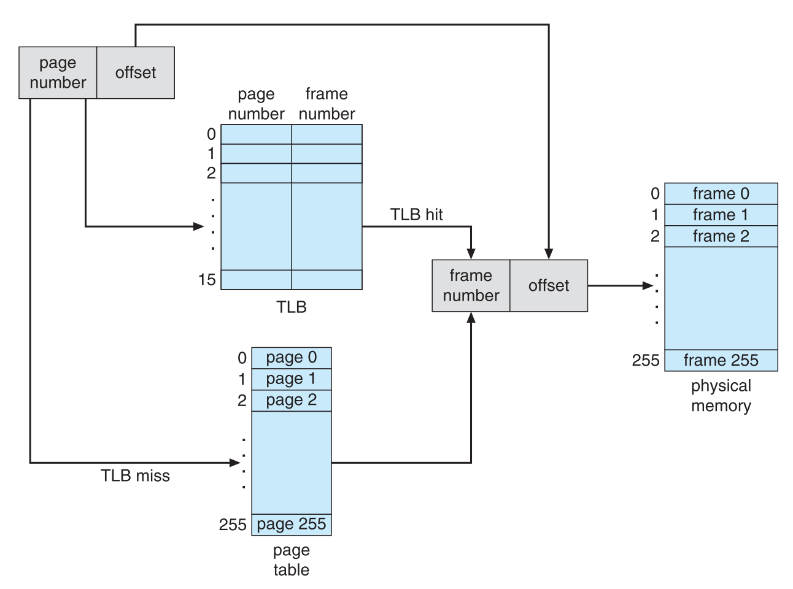

This project consists of writing a program that translates logical to physical addresses for a virtual address space of 
size 216 = 65,536 bytes. Your program will read from a file containing logical addresses and, using a TLB and a page 
table, will translate each logical address to its corresponding physical address and output the value of the byte stored 
at the translated physical address. Your learning goal is to use simulation to understand the steps involved in translating 
logical to physical addresses. This will include resolving page faults using demand paging, managing a TLB, and 
implementing a page-replacement algorithm.

### Details
<!--  -->

Other specifics include the following:
* 28 entries in the page table 
* Page size of 28 bytes 
* 16 entries in the TLB 
* Frame size of 28 bytes 
* 256 frames 
* Physical memory of 65,536 bytes (256 frames × 256-byte frame size)    

Additionally, your program need only be concerned with reading logical
addresses and translating them to their corresponding physical addresses. You do not need to support writing to the 
logical address space.

### Address Translation

### Handling Page Faults
Your program will implement demand paging as described in Section 10.2. The backing store is represented by the file 
`BACKING STORE.bin`, a binary file of size 65,536 bytes located in `StartKit` directory. When a page fault occurs, you 
will read in a 256-byte page from 
the file BACKING STORE and store it in an available page frame in physical memory. For example, if a logical address with 
page number 15 resulted in a page fault, your program would read in page 15 from BACKING STORE (remember that pages 
begin at 0 and are 256 bytes in size) and store it in a page frame in physical memory. Once this frame is stored (and 
the page table and TLB are updated), subsequent accesses to page 15 will be resolved by either the TLB or the page table.

You will need to treat BACKING STORE.bin as a random-access file so that
you can randomly seek to certain positions of the file for reading. We suggest using the standard C library functions 
for performing I/O, including `fopen()`, `fread()`, `fseek()`,and `fclose()`. The size of physical memory is the same as the size
of the virtual address space, i.e., 65,536 bytes, so you do not need to be concerned about page replacements during a page fault. Later, 
we describe a modification to this project using a smaller amount of physical memory; at that point, a page-replacement 
strategy will be required.

### Test Files Located in StartKit
We provide the file `addresses.txt`, which contains integer values representing logical addresses ranging from 0 to 65535 
(the size of the virtual address space). Your program will open this file, read each logical address and translate it to 
its corresponding physical address, and output the value of the signed byte at the physical address.

### Page Replacement
Thus far, this project has assumed that physical memory is the same size as the virtual address space.
In practice however, physical memory is typically much smaller than a virtual address space. This phase of the project now 
assumes using a smaller physical address space with 128 page frames rather than 256. This change will require modifying 
your program so that it keeps track of free page frames as well as implementing a page-replacement policy using 
LRU (Section 10.4) to resolve page faults when there is no free memory.

### Statistics 
After completion, your program is to report the following statistics:
1. Page-fault rate: the percentage of address references that resulted in page faults.
2. TLB hit rate: the percentage of address references that were resolved in the TLB.
